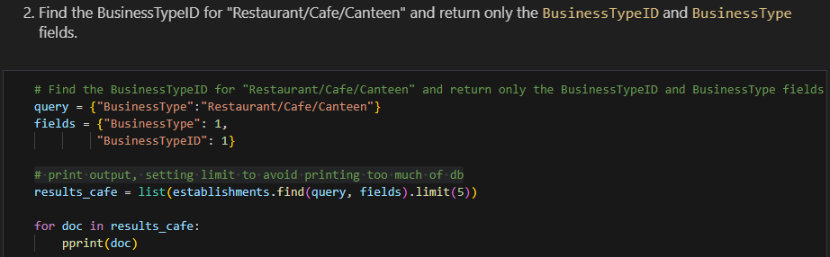
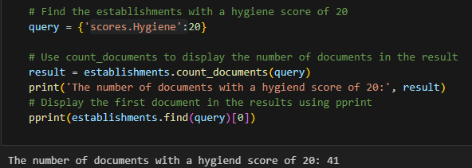
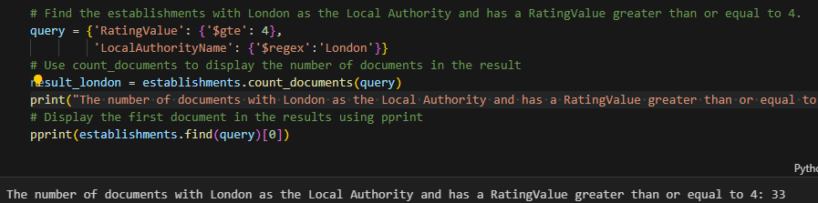
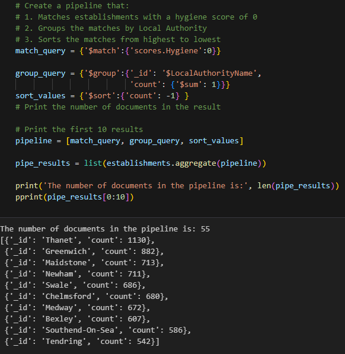
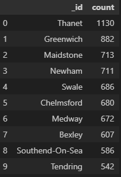

# Module 12 - nosql-challenge
---------------------------------------------------------------

## Eat, Safe, Love Ratings Data Evaluation
In this challenge I play the role of a Data Scientist working for the UK Food Standards Agency, and have been contracted by the editors of a food magazine, Eat Safe, Love, to evaluate some of the ratings data in order to help their journalists and food critics decide where to focus future articles. I used my NoSQL database skills to import, modify and query data for analysis to answer the editor requests. 

## Table of Contents

- [About & Analysis](#about--analysis)
- [Getting Started & Installing](#getting-started--installing)
- [Installation Info](#installation-info)
- [Contributing](#contributing)

## About & Analysis
This challenge was broken down into 3 parts: <br>
**Part 1 Database Setup**  Where I first imported the data. Confirmed the database was created with ```mongo.list_database_names()```, Listed the collections with ```db.list_collection_names()``` to verify the were created successfully. A ```find.one()``` to test the data. As well variable assignment for the collection and database for simplifying their reference in my syntax throughout the project.
**Part 2 Update the Database** The magazine editors requested that data for the new restaurant *Penang Flavours* be added to the database, first i saved the data into a variable and then ran an ```insert_one()```statement to add the new data into a document. The next requirement was as follows: 
 <br>
After this I needed to delete any documents where the "LocalAuthorityName" was Dover, a ```delete_many()``` statement acheived this. Finally, a few number values in each document required data type coversion from strings to decimals and numbers. The following 2 code blocks acheived this:
```
establishments.update_many({}, 
                           [ {'$set':{ "geocode.longitude" : {'$toDecimal': "$geocode.longitude"}, 
                                       "geocode.latitude" : {'$toDecimal': "$geocode.latitude" }}} ])
establishments.update_many({}, 
                           [ {'$set':{ "RatingValue" : {'$toInt': "$RatingValue"}, }} ])
```
**Part 3 Exploratory Analysis** In this section I answered several queries posed by the article editors and discovered some things about the hygiene ratings of many establishments across the UK. 
**Important Note** - The scores for Hygiene, Structural, and ConfidenceInManagement work in reverse. This means, the higher the value, the worse the establishment is in these areas. <br>
* I found the number of establishments in the UK with a hygiene score of 20, which I would highly recommend AVOIDING by the way. <br>
 <br>
* The number of establishment in London which have a *RatingValue* >= 4, which I WOULD RECOMMEND visiting. <br>
 <br>
* The next question was to find the top 5 establishments closest to the the newly added restaurant *Penang Flavours* with a *RatingValue* of 5 and sort them by lowest hygiene Score. They were:
1. Volunteer (BusinessType : pub/bar/nightclub)
2. Plumstead Manor Nursery (BusinessType: Caring Premises)
3. Atlantic Fish Bar (BusinessType: Takeaway/sandwich bar)
4. Iceland (BusinessType: Retailers - supermarkets/hypermarkets)
5. Howe and Co Fish and Chips - Van 17 (BusinessType: Mobile caterer) <br>

All of which possess hygiene scores of 0 and are all safe bets to visit. Volunteer is best for a more upbeat/going out type of night as it does turn into a nightclub, Plumstead Manor Nursery if you have kids and are looking for a caretaker. Atlantic Fish Bar for a more casual takeout style meal (Takeaway is the british term for our takeout), finally Iceland is a safe bet for every day grocery needs.
* The final question I answered was to find out how many establishments in each *LocalAuthorityName* had perfect hygiene scores (perfect = 0), organized into a dataframe sorted greatest to least. To do so I created the following aggregation pipeline: <br>
 <br>
As mentioned before, formed the raw output into this clean dataframe. <br>
 <br>
This information would be helpful to those planning to visit the UK and are looking for good areas to stop to eat. With the higher the position on the list meaning the more of a reputation for clean and hygienic establishments. 


## Getting Started & Installing
Installations required to run these files successfully:
* __PyMongo__
* __MongoDB__
* __mongoimport__

## Installation Info
Links/commands if installations are needed:

1. Install pymongo:
```
pip install pymongo
```
Desired command line when successful (versions may differ):
```
(dev) MBP:~ User$ conda list pymongo
# packages in environment at /opt/anaconda3/envs/dev:
#
# Name                    Version                     Build  Channel
pymongo                   3.12.0            py310he9d5cce_0
```

2. To Install __MongoDB__ __mongoimport__ follow this link:
[Download & Install MongDB](https://www.mongodb.com/docs/v6.0/installation/)
Instructions for all major operating systems are included.

## Contributing 
Justin Butler